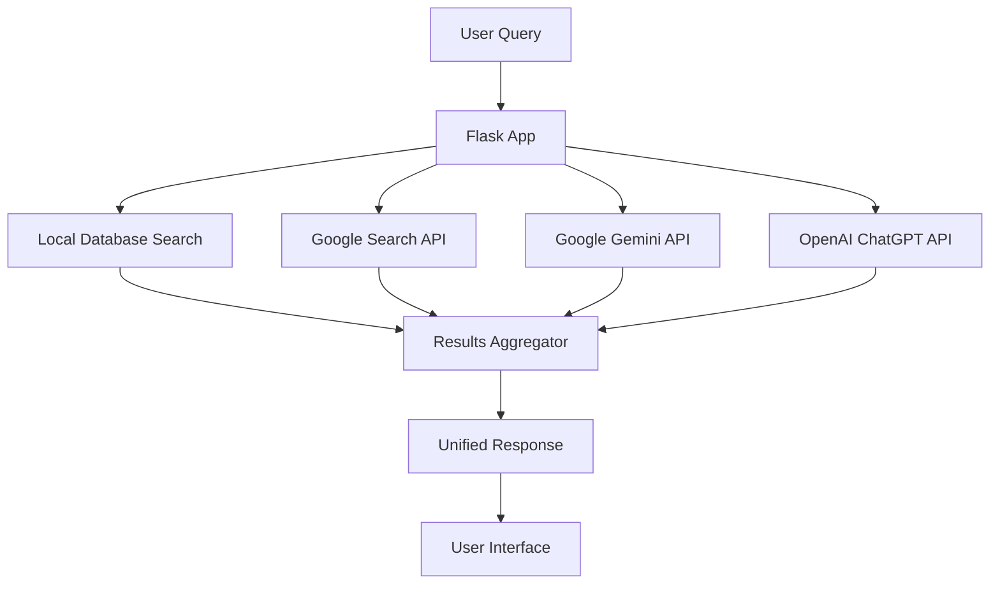

# AI Knowledge Base

> A self-contained Flask application that provides an intelligent knowledge management system with AI-powered Q&A, modern UI, and comprehensive article management capabilities.

[](https://www.python.org/downloads/)
[](https://flask.palletsprojects.com/)
[](LICENSE)

## 🌟 Features

### 🎯 **Intelligent Search System**
- **Local Knowledge Base Search**: Lightning-fast searches through your personal article collection
- **Multi-API Integration**: Simultaneous queries to Google Search, Google Gemini, and OpenAI ChatGPT
- **Real-time Progress Tracking**: Visual progress bars and status updates during searches
- **Smart Result Aggregation**: Combines local and external results in a unified interface

### 🎨 **Modern User Interface**
- **Dashboard-Style Design**: Clean, responsive interface optimized for productivity
- **Floating Search Bar**: Accessible search functionality from anywhere in the app
- **Progressive Enhancement**: Works seamlessly across desktop and mobile devices
- **Intuitive Navigation**: Collapsible sidebar with organized content groups

### 📚 **Advanced Article Management**
- **Rich Content Support**: Full Markdown rendering with syntax-highlighted code blocks
- **Comprehensive Metadata**: Add notes, multi-line references, and comma-separated tags
- **CRUD Operations**: Create, read, update, and delete articles with ease
- **Bulk Actions**: Multi-select articles for batch operations (tagging, deletion, updates)

### 🗂️ **Robust Organization System**
- **Color-Coded Groups**: Visual organization with customizable color schemes
- **Nested Categories**: Create hierarchical group structures for complex organization
- **Dynamic Group Creation**: Add new groups on-the-fly during article creation
- **Flexible Tagging**: Free-form tagging system with auto-suggestions

### ⚙️ **Web-Based Configuration**
- **Settings Dashboard**: User-friendly interface for all configuration options
- **Secure API Key Management**: Local storage of sensitive credentials
- **Real-time Configuration**: Changes take effect immediately without restart
- **Export/Import Settings**: Backup and restore your configuration

## 🚀 Quick Start

### Prerequisites

- **Python 3.7+** - [Download Python](https://www.python.org/downloads/)
- **pip** - Python package installer (included with Python)
- **Virtual Environment** (recommended) - For dependency isolation

### Installation

1. **Clone or Download the Repository**
   ```bash
   # Create your project directory
   mkdir ai-knowledge-base
   cd ai-knowledge-base
   
   # Download all files: app.py, requirements.txt, and templates/ directory
   ```

2. **Set Up Virtual Environment** (Highly Recommended)
   ```bash
   # macOS/Linux
   python3 -m venv venv
   source venv/bin/activate
   
   # Windows
   python -m venv venv
   .\venv\Scripts\activate
   ```
   
   You'll see `(venv)` at the beginning of your command prompt when active.

3. **Install Dependencies**
   ```bash
   pip install -r requirements.txt
   ```

4. **Database Setup**
   > ⚠️ **Important**: If upgrading from a previous version, delete the existing `kb.db` file to ensure compatibility with database schema changes.

### Running the Application

#### Development Mode
```bash
python app.py
```

#### Production Mode (Recommended)
```bash
# Install waitress if not included in requirements
pip install waitress

# Run with production server
waitress-serve --host 127.0.0.1 --port=5050 app:app
```

The application will be available at: **http://127.0.0.1:5050**

## 🔑 API Configuration

### Required API Keys

#### 1. Google Gemini API Key
- **Source**: [Google AI Studio](https://aistudio.google.com/)
- **Purpose**: AI-powered intelligent responses
- **Cost**: Free tier available with generous quotas

#### 2. Google Custom Search API
- **API Key**: [Google Cloud Console](https://console.cloud.google.com/)
- **Search Engine ID**: [Custom Search Engine](https://cse.google.com/)
- **Purpose**: Web search integration
- **Setup**: Requires both API key and custom search engine configuration

#### 3. OpenAI API Key
- **Source**: [OpenAI API Platform](https://platform.openai.com/api-keys)
- **Purpose**: ChatGPT integration for AI responses
- **Cost**: Pay-per-use pricing model

### Configuration Steps

1. **Launch the Application**
   ```bash
   python app.py
   ```

2. **Access Settings**
   - Navigate to http://127.0.0.1:5050
   - Click the **Settings** icon (⚙️) in the top-right corner

3. **Enter API Keys**
   - Paste your API keys into the appropriate fields
   - Click **Save Settings**
   - Keys are stored securely in local `config.json`

4. **Set Up Groups** (Optional)
   - Use the "Manage Groups" section to create initial categories
   - Set up nested group structures as needed

## 📁 Project Structure

```
ai-knowledge-base/
├── app.py                    # Main Flask application
├── requirements.txt          # Python dependencies
├── config.json              # Runtime configuration (auto-generated)
├── kb.db                    # SQLite database (auto-generated)
├── templates/               # HTML templates
│   ├── base.html            # Base template
│   ├── index.html           # Main dashboard
│   ├── settings.html        # Configuration interface
│   └── ...                  # Additional templates
├── static/                  # Static assets (if present)
│   ├── css/                 # Stylesheets
│   ├── js/                  # JavaScript files
│   └── images/              # Image assets
└── venv/                    # Virtual environment (created by you)
```

## 🔧 Technical Architecture

### Core Components

#### **Flask Application (`app.py`)**
- **Route Management**: Handles all HTTP requests and responses
- **Database Operations**: SQLite integration for local data storage
- **API Orchestration**: Coordinates calls to external services
- **Error Handling**: Graceful degradation when services are unavailable

#### **Database Layer**
- **Technology**: SQLite for lightweight, serverless operation
- **Schema**: Articles, groups, tags, and metadata tables
- **Features**: ACID compliance, concurrent read access, automatic backup

#### **Template System**
- **Engine**: Jinja2 template rendering
- **Components**: Modular template structure for maintainability
- **Responsive Design**: Mobile-first approach with progressive enhancement

### API Integration Architecture



### Data Flow

1. **Search Initiation**: User submits query through the interface
2. **Parallel Processing**: App simultaneously queries local DB and external APIs
3. **Result Aggregation**: Combines and ranks results from all sources
4. **Response Rendering**: Presents unified results with source attribution
5. **Action Integration**: Provides options to create articles from search results

## 📊 Features Deep Dive

### Search Functionality

#### **Local Knowledge Base Search**
- **Algorithm**: Full-text search across article content, titles, and tags
- **Performance**: Indexed SQLite queries for sub-second response times
- **Relevance**: Ranking based on content match and recency

#### **External API Integration**
- **Google Search**: Web results with automatic link extraction
- **Google Gemini**: AI-generated responses with contextual understanding
- **OpenAI ChatGPT**: Conversational AI responses with reasoning

#### **Error Resilience**
- **Graceful Degradation**: App continues functioning if APIs are unavailable
- **Rate Limit Handling**: Clear user notifications when quotas are exceeded
- **Timeout Management**: Prevents hanging requests from blocking the interface

### Article Management

#### **Content Creation**
- **Auto-populated Fields**: Search queries automatically fill article titles
- **Tag Suggestions**: Existing tags displayed as clickable buttons
- **Reference Integration**: Google Search results automatically added to references
- **Group Assignment**: Dynamic group selection with creation options

#### **Rich Content Support**
- **Markdown Rendering**: Full CommonMark specification support
- **Code Highlighting**: Syntax highlighting for 100+ programming languages
- **Media Embedding**: Support for images, links, and structured content
- **Export Options**: Articles can be exported in various formats

#### **Bulk Operations**
- **Multi-select Interface**: Checkbox-based selection system
- **Batch Updates**: Update tags, notes, and references for multiple articles
- **Bulk Deletion**: Remove multiple articles with confirmation prompts
- **Progress Tracking**: Visual feedback for long-running operations

### Organization System

#### **Group Management**
- **Hierarchical Structure**: Unlimited nesting levels for complex organization
- **Color Coding**: Visual distinction with customizable color schemes
- **Collapsible Interface**: Streamlined view with expandable sections
- **Search Integration**: Filter articles by group membership

#### **Tagging System**
- **Free-form Tags**: No restrictions on tag creation or format
- **Auto-completion**: Suggests existing tags during article creation
- **Tag Analytics**: View most-used tags and their article counts
- **Batch Tagging**: Apply tags to multiple articles simultaneously

## 🛠️ Configuration Options

### Application Settings

#### **Search Configuration**
- **Timeout Settings**: Adjust API request timeouts
- **Result Limits**: Configure maximum results per source
- **Cache Duration**: Set local cache expiration times
- **Default Groups**: Specify default group for new articles

#### **UI Preferences**
- **Theme Options**: Light/dark mode preferences
- **Layout Settings**: Sidebar width, article preview length
- **Search Behavior**: Auto-search, result sorting preferences
- **Keyboard Shortcuts**: Customizable hotkey assignments

#### **API Management**
- **Rate Limiting**: Configure per-API rate limits
- **Failover Settings**: Backup API configurations
- **Monitoring**: Usage tracking and quota monitoring
- **Security**: API key rotation and validation

## 🔒 Security Considerations

### Data Protection
- **Local Storage**: All sensitive data stored locally, not in the cloud
- **API Key Security**: Credentials stored in local configuration files only
- **No External Logging**: Personal data never transmitted to third parties
- **Secure Defaults**: Conservative security settings out of the box

### Privacy Features
- **Offline Operation**: Core functionality works without internet connection
- **Data Ownership**: Complete control over your knowledge base
- **No Tracking**: No analytics or user behavior tracking
- **Export Freedom**: Easy data export and migration options

## 🧪 Development

### Local Development Setup

```bash
# Clone the repository
git clone https://github.com/mightywomble/aiknowledgebase.git
cd aiknowledgebase

# Set up development environment
python -m venv dev-env
source dev-env/bin/activate  # or dev-env\Scripts\activate on Windows

# Install development dependencies
pip install -r requirements.txt
pip install flask[dev]  # Development extras

# Run in debug mode
export FLASK_ENV=development  # Linux/macOS
set FLASK_ENV=development     # Windows
python app.py
```

### Testing

```bash
# Run basic functionality tests
python -m pytest tests/  # If test suite exists

# Manual testing checklist
# 1. Search functionality with and without APIs
# 2. Article CRUD operations
# 3. Group management
# 4. Settings persistence
# 5. Error handling scenarios
```

### Customization

#### **Adding New APIs**
1. Update `app.py` with new API integration
2. Add configuration fields to settings template
3. Implement error handling and rate limiting
4. Update result aggregation logic

#### **UI Modifications**
1. Modify templates in `templates/` directory
2. Add custom CSS in static files
3. Extend JavaScript functionality
4. Test responsive behavior

#### **Database Schema Changes**
1. Create database migration scripts
2. Update model definitions in `app.py`
3. Provide upgrade/downgrade paths
4. Test with existing data

## 🐛 Troubleshooting

### Common Issues

#### **Application Won't Start**
```bash
# Check Python version
python --version  # Should be 3.7+

# Verify virtual environment
which python  # Should point to venv directory

# Check dependencies
pip list | grep -i flask

# Clear cache and restart
rm -rf __pycache__
python app.py
```

#### **API Integration Issues**
- **Invalid API Keys**: Verify keys in settings page
- **Quota Exceeded**: Check API usage in respective consoles
- **Network Issues**: Test internet connectivity
- **Rate Limiting**: Wait for rate limit reset or upgrade plan

#### **Database Problems**
```bash
# Reset database (WARNING: Deletes all data)
rm kb.db
python app.py  # Will recreate database

# Backup before reset
cp kb.db kb.db.backup
```

#### **Search Not Working**
- Verify API keys are correctly entered
- Check internet connection for external APIs
- Confirm local database has articles to search
- Review browser console for JavaScript errors

### Performance Optimization

#### **Large Knowledge Bases**
- **Database Indexing**: Automatic indexing on frequently searched fields
- **Pagination**: Large result sets automatically paginated
- **Caching**: Intelligent caching of API responses
- **Lazy Loading**: Templates load content as needed

#### **Memory Management**
- **Connection Pooling**: Efficient database connection management
- **Request Cleanup**: Automatic cleanup of request resources
- **Cache Limits**: Configurable memory usage limits
- **Background Tasks**: Non-blocking API requests

## 📈 Roadmap

### Planned Features
- [ ] **Import/Export Tools**: Bulk import from various formats (JSON, CSV, Markdown)
- [ ] **Advanced Search**: Boolean operators, date ranges, content type filters
- [ ] **Collaboration Features**: Share articles and groups with team members
- [ ] **Plugin System**: Extensible architecture for custom integrations
- [ ] **Mobile App**: Native mobile application for iOS and Android
- [ ] **Backup Automation**: Scheduled backups to cloud storage
- [ ] **Advanced Analytics**: Usage statistics and knowledge base insights

### Integration Possibilities
- **Slack Integration**: Search knowledge base from Slack
- **Browser Extension**: Save web pages directly to knowledge base
- **CLI Tool**: Command-line interface for power users
- **API Endpoints**: RESTful API for external integrations
- **Webhook Support**: Real-time updates and notifications

## 🤝 Contributing

We welcome contributions! Here's how you can help:

### Getting Started
1. Fork the repository
2. Create a feature branch (`git checkout -b feature/amazing-feature`)
3. Make your changes
4. Add tests if applicable
5. Commit your changes (`git commit -m 'Add amazing feature'`)
6. Push to the branch (`git push origin feature/amazing-feature`)
7. Open a Pull Request

### Contribution Guidelines
- Follow Python PEP 8 style guidelines
- Add docstrings to new functions and classes
- Update documentation for new features
- Ensure backward compatibility when possible
- Add tests for new functionality

## 📄 License

This project is licensed under the MIT License - see the [LICENSE](LICENSE) file for details.

## 🙏 Acknowledgments

- **Flask Community** - For the excellent web framework
- **Google AI** - For Gemini API access
- **OpenAI** - For ChatGPT integration
- **Contributors** - Everyone who has contributed to making this project better

## 📞 Support

- **Issues**: [GitHub Issues](https://github.com/mightywomble/aiknowledgebase/issues)
- **Discussions**: [GitHub Discussions](https://github.com/mightywomble/aiknowledgebase/discussions)
- **Documentation**: This README and inline code documentation

---

**Made with ❤️ by [mightywomble](https://github.com/mightywomble)**

*Transform your knowledge management with AI-powered search and intelligent organization.*